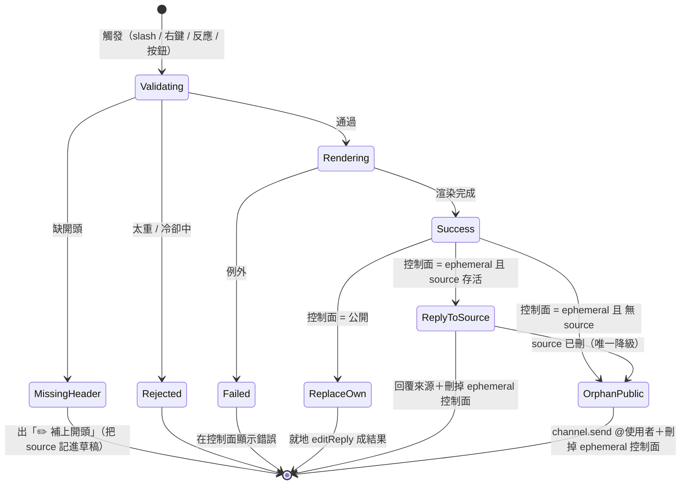

# SimaiRenderBot

Discord bot：輸入 simai 語法片段 → 產出譜面預覽 GIF。

渲染核心提取自 [web-mai-chart-x](https://github.com/susuy0725/web-mai-chart-x)（decode / renderer / helper），
以無頭 Chromium 逐幀畫 canvas，PNG 幀直接串給 ffmpeg 轉成壓縮 GIF。

## 架構

```
simai 文字
  → Playwright 無頭 Chromium 開 web/render.html
      → simaiDecode() 解析 → SimaiLogicControler 逐幀算狀態 → SimaiRenderer 畫 canvas
      → 每幀 toDataURL 成 PNG，透過 __emitFrame binding 串回 Node
  → ffmpeg 從 stdin 讀 PNG 序列，palettegen 兩段式轉 GIF + gifsicle lossy 二次壓縮（自動降畫質直到 < 10MB）
  → Discord 附件回覆
```

以 PNG 幀直接串給 ffmpeg，跳過了 WebCodecs 的 H.264 中間層（那趟編碼/解碼對最終 GIF 畫質毫無幫助，畫質由調色盤量化決定）；
且瀏覽器直接以 GIF 輸出的 15fps 渲染（而非畫 30fps 再丟一半）。兩者合計讓固定開銷約砍半、稀疏長譜面渲染再快 15~25%。
副帶好處：不再需要瀏覽器支援 H.264 編碼，vanilla Playwright Chromium 也能跑。

## 需求

- Node.js 22+
- ffmpeg（`brew install ffmpeg`）
- gifsicle（`brew install gifsicle`，選用但強烈建議：GIF 可再省 30~50% 體積；沒裝也能跑，只是檔案較大）
- Google Chrome（或執行 `npx playwright install chromium`）

## 安裝與測試

```bash
npm install

# CLI 測試（不需要 Discord）
node src/cli.js "(150){4}1,2,3,4,E" out/test.gif
node src/cli.js --file chart.txt out/test.gif
```

## 當引擎嵌入（程式 API）

渲染引擎跟 Discord 完全解耦，可以直接 `import` 進自己的專案，把 simai 文字變成 GIF Buffer。核心就一個類別 [`SimaiRenderService`](src/render.js)（[src/cli.js](src/cli.js) 是最小可運行範例）。

```js
import { SimaiRenderService } from './src/render.js';

const service = new SimaiRenderService();
await service.init();                 // 起一次瀏覽器 + 靜態伺服器（重，整個生命週期只做一次）

try {
    // 只解析、不渲染：先拿長度 / BPM / note 數 / 語法警告
    const info = await service.inspect('(150){4}1,2,3,4,E');
    // → { endTime, bpm, noteCounts, warns, warnpos }

    // 渲染成 GIF
    const { gif, duration, quality, warns } = await service.renderGif('(150){4}1,2,3,4,E', {
        start: 0,        // 起點秒數（相對譜面時間軸）
        end: null,       // 終點秒數，null = 譜面結尾
        width: 480,      // 輸出寬（正方形，高等於寬）
        maxDuration: 30, // 超過的尾段不畫
    });
    // gif 是 Buffer，直接寫檔或當附件都行
    await (await import('node:fs')).promises.writeFile('out.gif', gif);
} finally {
    await service.dispose();          // 關瀏覽器 + 伺服器
}
```

### API 一覽

| 方法 | 回傳 | 說明 |
|---|---|---|
| `new SimaiRenderService()` | — | 建立實例，尚未啟動 |
| `await service.init()` | `void` | 啟動瀏覽器與靜態伺服器。**用前必呼叫一次**，成本高，請重用同一實例、勿每次渲染都 init |
| `await service.inspect(simai)` | `{ endTime, bpm, noteCounts, warns, warnpos }` | 只解析不渲染，用來預檢語法 / 估長度。`noteCounts` 可能為 `null` |
| `await service.renderGif(simai, opts?)` | `{ gif, duration, warns, warnpos, quality }` | 主入口，`gif` 是 GIF `Buffer`。`quality` 是實際採用的壓縮階（`{ fps, width, colors, bayerScale }`） |
| `service.estimateRenderMs(durationSec, totalNotes)` | `number`（毫秒） | 不實跑就估耗時。`totalNotes` = `Object.values(info.noteCounts)` 加總 |
| `await service.dispose()` | `void` | 收掉瀏覽器與伺服器，程式結束前呼叫 |

`estimateRenderMs` 也可單獨 `import { estimateRenderMs } from './src/render.js'`（純函式，不需要實例）。

### `renderGif` 的 opts

| 欄位 | 預設 | 說明 |
|---|---|---|
| `width` | `480` | 輸出寬（正方形；壓縮階梯可能為了塞進大小上限再往下降到 360/320/280/240） |
| `start` | `0` | 起點秒數 |
| `end` | `null` | 終點秒數，`null` = 譜面結尾 |
| `maxDuration` | `30` | 渲染長度硬上限（秒），超過的尾段不畫 |
| `sizeLimit` | `9.5 * 1024 * 1024` | GIF 體積上限（bytes）；壓到最低品質仍超過就丟 `GIF_TOO_LARGE` |

### 注意事項

- **序列化**：同一分頁不能並行渲染，`inspect` / `renderGif` 內部用一條 queue 排隊；併發呼叫是安全的，但會一個一個跑。要吞吐就開多個 `SimaiRenderService` 實例。
- **相依**：`renderGif` 需要 `ffmpeg`（必要）與 Chrome/Chromium；`gifsicle` 選用（沒裝只是檔案較大，不會報錯）。細節見上方[需求](#需求)。
- **例外**：語法空譜面 `EMPTY_CHART`、範圍錯誤 `BAD_RANGE`、壓不進上限 `GIF_TOO_LARGE`、收不到影格 `NO_FRAMES`；訊息都是 `錯誤碼: 說明` 的格式。
- 渲染邏輯本身在 [web/render.html](web/render.html) 的 `window.renderChartToFrames`（逐幀 PNG 串回 Node），Node 端只負責串 ffmpeg 轉 GIF；要改畫面行為改那裡，要改輸出/壓縮改 [src/render.js](src/render.js)。

## 啟動 Discord bot

1. 到 [Discord Developer Portal](https://discord.com/developers/applications) 建立 Application → Bot，拿 Token
2. `cp .env.example .env`，填入 `DISCORD_TOKEN`、`DISCORD_APP_ID`（測試時建議也填 `DISCORD_GUILD_ID`）
3. 註冊指令並啟動：

```bash
npm run register
npm run bot
```

邀請連結權限：`applications.commands` + `bot`（Send Messages、Attach Files）。

## 指令

| 入口 | 說明 |
|---|---|
| `/render simai:<語法> [start] [end] [fps]` | 渲染成 GIF 回覆（公開）。單行輸入用 |
| `/check simai:<語法>` | 只解析：長度 / BPM / note 統計 / 語法警告（僅自己可見） |
| `/keyboard`（隱藏中） | 互動鍵盤：圓形按鈕點出譜面。預設不註冊，`.env` 設 `ENABLE_KEYBOARD=1` 後 `npm run register` 開啟 |
| `/compose` | 跳出多行輸入視窗（Modal），貼入 simai 後回覆整理好的 ` ```simai``` ` 區塊 + 🎬 渲染按鈕，10 分鐘內有效 |
| 右鍵訊息 → Apps → 渲染譜面 | 渲染整則訊息（有 code block 就抓 code block，否則吃整段文字），多行譜面用這個 |
| 貼出 ` ```simai ` code block | bot 自動加 🎬 反應，有人點了才渲染（避免洗版） |

渲染結果（GIF）本身不附 simai 文字，只有 Embed + 圖片；需要可複製的 simai 文字請用 `/compose`。
每個渲染入口都會依序更新狀態：`✅ 已收到，準備渲染…` → `🎬 正在渲染中，預估約 N 秒，請稍候…` → 最終結果。
預估秒數來自 `estimateRenderMs()`（[src/render.js](src/render.js)）：對 9 組長度×密度組合實測擬合的迴歸公式
`ms ≈ (523 + 143.6×秒數 + 65×總音符數) × 1.15`（PNG 串流管線下重新擬合，誤差多在 ±3%）。

多行譜面建議直接在頻道貼：

````
```simai
(150){4}
1,2,3,4,
E
```
````

- 開頭沒寫 `(BPM){分拍}` 會直接被擋下，不會讓 decode.js 靜默套用 60bpm/{4} 預設值渲染出錯誤結果；
  拒絕訊息會附一顆「✏️ 補上開頭」按鈕，點下去跳出表單——**智能判斷缺哪一半**，只顯示缺的欄位（BPM 或分拍或兩者），
  並帶出原本的譜面內容，填完自動接上缺的設定
- 語法警告會用 code block + `^^^` 指出出錯的逗號段
- 🎬 自動偵測需要在 Developer Portal → Bot 開啟 **Message Content Intent**
- 單次渲染的譜面長度上限預設 30 秒（`MAX_DURATION`），超過的部分不畫，太長請用 `start`/`end` 選段
- 渲染前先估算耗時，**預估超過 30 秒（`MAX_RENDER_SEC`）就直接拒絕**，不讓使用者空等；主要會擋到極端密集的譜面
- GIF 會自動走壓縮階梯直到低於 Discord 10MB 上限：**fps 固定 15**（優先保留流暢度），逐級妥協的是色數與寬度（360px/64色 → 320px/48色 → 280px/32色），最後一級才不得已降到 12fps/240px；每級都會過 gifsicle `--lossy=100` 二次壓縮
- 每人預設 10 秒冷卻（`COOLDOWN_MS`）

## 渲染輸出狀態機

不同入口的渲染結果該貼哪、要不要 @ 人，由 [`runInteractionRender`](src/bot.js) → [`emitResult`](src/bot.js) 這組狀態機決定。核心是**兩個正交的軸**：

- **控制面**（渲染過程中跟操作者對話的訊息）
  - **公開**：`/render` 的 `deferReply`。結果直接就地替換自己。
  - **ephemeral**：右鍵選單、`🎬 渲染這份` 按鈕。只有本人看得到，不能當公開結果，成功後自刪。
- **結果去向**（只有 ephemeral 控制面才需要決定）
  - **回覆來源訊息**：有存活的來源訊息（右鍵觸發，且一路帶過「補上開頭」繞路）。
  - **孤兒公開 + @使用者**：沒有來源（`/compose` 流程），或來源已被刪（唯一降級）。用 `channel.send` 送獨立訊息，不帶 reply 參照。



| 入口 | 控制面 | 結果去向 | @使用者？ |
|---|---|---|---|
| `/render` | 公開 | 替換自身 | ✗（slash 已標示觸發者） |
| 右鍵「渲染譜面」（有開頭） | ephemeral | 回覆來源 | ✗ |
| 右鍵 → 補上開頭 → 渲染這份 | ephemeral | 回覆來源（來源沒了才降級） | 降級才 @ |
| `🎬` 反應（有開頭） | 公開（reply 到來源） | 替換自身 | ✗ |
| `/compose` → 渲染這份 | ephemeral | 孤兒公開 | ✓ |

「來源被刪」不是特例錯誤，而是收斂成 `ReplyToSource → OrphanPublic` 這條**唯一降級邊**：回覆失敗就無聲改用 `channel.send` @使用者公開貼出，不會出現「回覆原始訊息已刪除」的殘框。

## 復讀機頻道（額外功能）

指定頻道（`src/bot.js` 的 `ECHO_CHANNEL_ID`）內任何人發言，bot 會原樣重複一次，不做 simai 偵測；其他頻道不受影響。

## 檔案結構

```
web/render.html        無 UI 渲染頁：window.renderChartToFrames(simai, opts) 逐幀 PNG 串回 Node
web/Scripts/           自 web-mai-chart-x 提取的核心（未修改）
web/Skin/  web/Fonts/  素材
src/server.js          服務 web/ 的極簡靜態伺服器
src/render.js          SimaiRenderService：常駐瀏覽器 + ffmpeg GIF 壓縮階梯
src/cli.js             本機測試 CLI
src/register-commands.js  Slash command 註冊
src/bot.js             Discord bot 本體
```

## 致謝

`web/Scripts/`（decode.js / renderer.js / helper.js / indexDB.js）與 `web/Skin/`、`web/Fonts/`
均直接提取自 [susuy0725/web-mai-chart-x](https://github.com/susuy0725/web-mai-chart-x)，未修改渲染邏輯本身。
該專案的 Skin 與音訊素材則源自 [LingFeng-bbben/MajdataView](https://github.com/LingFeng-bbben/MajdataView) 與
[re-poem/MajdataViewX](https://github.com/re-poem/MajdataViewX)。

> ⚠️ web-mai-chart-x 本身未附 LICENSE 檔案。發佈本專案前，建議先向原作者確認授權方式，
> 或至少在你的 repo 說明中保留以上出處與致謝。
