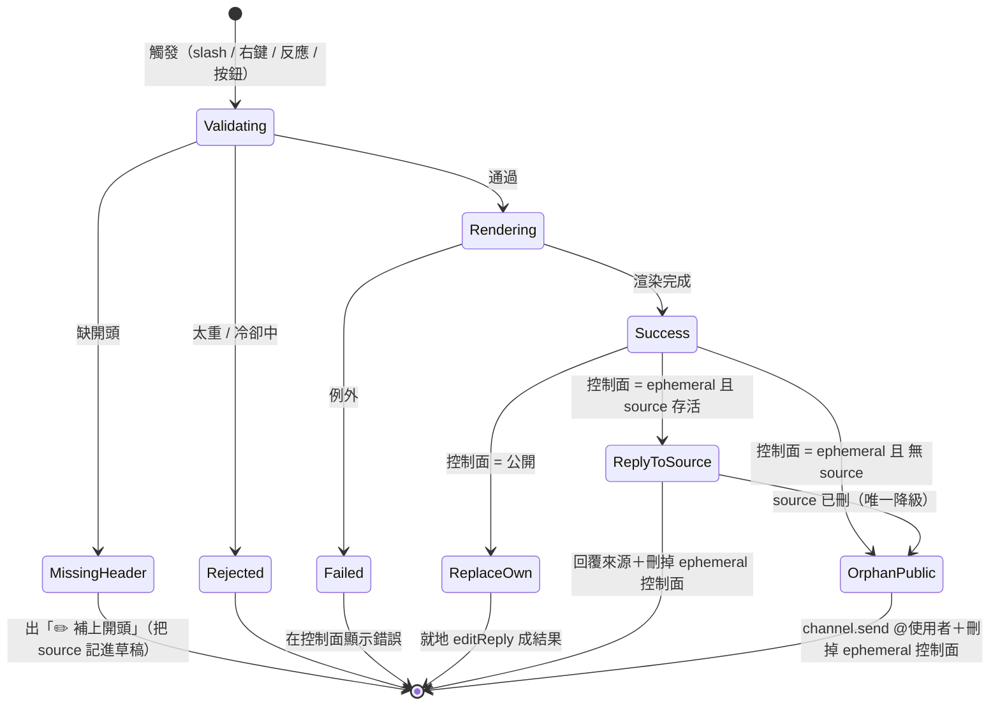

# SimaiRenderBot

Discord bot：輸入 simai 語法片段 → 產出譜面預覽 GIF。

渲染核心提取自 [web-mai-chart-x](https://github.com/susuy0725/web-mai-chart-x)（decode / renderer / helper），
以無頭 Chromium 逐幀畫 canvas，PNG 幀直接串給 ffmpeg 轉成壓縮 GIF。

## 架構

```
simai 文字
  → Playwright 無頭 Chromium 開 web/render.html
      → simaiDecode() 解析 → SimaiLogicControler 逐幀算狀態 → SimaiRenderer 畫 canvas
      → 每幀 toDataURL 成 PNG，透過 __emitFrame binding 串回 Node
  → ffmpeg 從 stdin 讀 PNG 序列，palettegen 兩段式轉 GIF + gifsicle lossy 二次壓縮（自動降畫質直到 < 10MB）
  → Discord 附件回覆（16:9 寬版，例如 640×360）
```

以 PNG 幀直接串給 ffmpeg，跳過了 WebCodecs 的 H.264 中間層（那趟編碼/解碼對最終 GIF 畫質毫無幫助，畫質由調色盤量化決定）；
且瀏覽器直接以 GIF 輸出的 15fps 渲染（而非畫 30fps 再丟一半）。兩者合計讓固定開銷約砍半、稀疏長譜面渲染再快 15~25%。
副帶好處：不再需要瀏覽器支援 H.264 編碼，vanilla Playwright Chromium 也能跑。

## 需求

- Node.js 22+
- ffmpeg（`brew install ffmpeg`）
- gifsicle（`brew install gifsicle`，選用但強烈建議：GIF 可再省 30~50% 體積；沒裝也能跑，只是檔案較大）
- Google Chrome（或執行 `npx playwright install chromium`）

## 安裝與測試

```bash
npm install

# CLI 測試（不需要 Discord）
node src/cli.js "(150){4}1,2,3,4,E" out/test.gif
node src/cli.js --file chart.txt out/test.gif
```

## 當引擎嵌入（程式 API）

渲染引擎跟 Discord 完全解耦，可以直接 `import` 進自己的專案，把 simai 文字變成 GIF Buffer。核心就一個類別 [`SimaiRenderService`](src/render.js)（[src/cli.js](src/cli.js) 是最小可運行範例）。

```js
import { SimaiRenderService } from './src/render.js';

const service = new SimaiRenderService();
await service.init();                 // 起一次瀏覽器 + 靜態伺服器（重，整個生命週期只做一次）

try {
    // 只解析、不渲染：先拿長度 / BPM / note 數 / 語法警告
    const info = await service.inspect('(150){4}1,2,3,4,E');
    // → { endTime, bpm, noteCounts, warns, warnpos }

    // 渲染成 GIF
    const { gif, duration, quality, warns } = await service.renderGif('(150){4}1,2,3,4,E', {
        start: 0,        // 起點秒數（相對譜面時間軸）
        end: null,       // 終點秒數，null = 譜面結尾
        width: 480,      // 輸出寬（正方形，高等於寬）
        maxDuration: 30, // 超過的尾段不畫
    });
    // gif 是 Buffer，直接寫檔或當附件都行
    await (await import('node:fs')).promises.writeFile('out.gif', gif);
} finally {
    await service.dispose();          // 關瀏覽器 + 伺服器
}
```

### API 一覽

| 方法 | 回傳 | 說明 |
|---|---|---|
| `new SimaiRenderService()` | — | 建立實例，尚未啟動 |
| `await service.init()` | `void` | 啟動瀏覽器與靜態伺服器。**用前必呼叫一次**，成本高，請重用同一實例、勿每次渲染都 init |
| `await service.inspect(simai)` | `{ endTime, bpm, noteCounts, warns, warnpos }` | 只解析不渲染，用來預檢語法 / 估長度。`noteCounts` 可能為 `null` |
| `await service.renderGif(simai, opts?)` | `{ gif, duration, warns, warnpos, quality }` | 主入口，`gif` 是 GIF `Buffer`。`quality` 是實際採用的壓縮階（`{ fps, width, colors, bayerScale }`） |
| `service.estimateRenderMs(durationSec, totalNotes)` | `number`（毫秒） | 不實跑就估耗時。`totalNotes` = `Object.values(info.noteCounts)` 加總 |
| `await service.dispose()` | `void` | 收掉瀏覽器與伺服器，程式結束前呼叫 |

`estimateRenderMs` 也可單獨 `import { estimateRenderMs } from './src/render.js'`（純函式，不需要實例）。

### `renderGif` 的 opts

| 欄位 | 預設 | 說明 |
|---|---|---|
| `width` | `960` | 渲染畫布寬 |
| `height` | `540` | 渲染畫布高（預設 16:9；譜面是正方形、置中，左右留背景色） |
| `start` | `0` | 起點秒數 |
| `end` | `null` | 終點秒數，`null` = 譜面結尾 |
| `maxDuration` | `30` | 渲染長度硬上限（秒），超過的尾段不畫 |
| `sizeLimit` | `9.5 * 1024 * 1024` | GIF 體積上限（bytes）；壓到最低品質仍超過就丟 `GIF_TOO_LARGE` |

輸出為 **16:9 寬版**，目的是讓 GIF 在 Discord 版面上不要佔掉太多垂直空間。
壓縮階梯會為了塞進 `sizeLimit` 逐級降到 `640 → 560 → 480 → 400` 寬（高度等比，例如 640×360）；
因為譜面只佔中間 9/16，這些數字比正方形輸出時大，換算後譜面實際像素才相當。

### 注意事項

- **序列化**：同一分頁不能並行渲染，`inspect` / `renderGif` 內部用一條 queue 排隊；併發呼叫是安全的，但會一個一個跑。要吞吐就開多個 `SimaiRenderService` 實例。
- **相依**：`renderGif` 需要 `ffmpeg`（必要）與 Chrome/Chromium；`gifsicle` 選用（沒裝只是檔案較大，不會報錯）。細節見上方[需求](#需求)。
- **例外**：語法空譜面 `EMPTY_CHART`、範圍錯誤 `BAD_RANGE`、壓不進上限 `GIF_TOO_LARGE`、收不到影格 `NO_FRAMES`；訊息都是 `錯誤碼: 說明` 的格式。
- 渲染邏輯本身在 [web/render.html](web/render.html) 的 `window.renderChartToFrames`（逐幀 PNG 串回 Node），Node 端只負責串 ffmpeg 轉 GIF；要改畫面行為改那裡，要改輸出/壓縮改 [src/render.js](src/render.js)。

## 啟動 Discord bot

1. 到 [Discord Developer Portal](https://discord.com/developers/applications) 建立 Application → Bot，拿 Token
2. `cp .env.example .env`，填入 `DISCORD_TOKEN`、`DISCORD_APP_ID`（測試時建議也填 `DISCORD_GUILD_ID`）
3. 註冊指令並啟動：

```bash
npm run register
npm run bot
```

邀請連結權限：`applications.commands` + `bot`（Send Messages、Attach Files）。

## 指令

| 入口 | 說明 |
|---|---|
| `/render simai:<語法> [start] [end] [fps]` | 渲染成 GIF 回覆（公開）。單行輸入用 |
| `/check simai:<語法>` | 只解析：長度 / BPM / note 統計 / 語法警告（僅自己可見） |
| `/keyboard`（隱藏中） | 互動鍵盤：圓形按鈕點出譜面。預設不註冊，`.env` 設 `ENABLE_KEYBOARD=1` 後 `npm run register` 開啟 |
| `/compose` | 跳出多行輸入視窗（Modal），貼入 simai 後回覆整理好的 ` ```simai``` ` 區塊 + 🎬 渲染按鈕，10 分鐘內有效 |
| 右鍵訊息 → Apps → 渲染譜面 | 渲染整則訊息（有 code block 就抓 code block，否則吃整段文字），多行譜面用這個 |
| 貼出 ` ```simai ` code block | bot 自動加 🎬 反應，有人點了才渲染（避免洗版） |

渲染結果（GIF）本身不附 simai 文字，只有 Embed + 圖片；需要可複製的 simai 文字請用 `/compose`。
每個渲染入口都會依序更新狀態：`✅ 已收到，準備渲染…` → `🎬 正在渲染中，預估約 N 秒，請稍候…` → 最終結果。
預估秒數來自 `estimateRenderMs()`（[src/render.js](src/render.js)）：對 9 組長度×密度組合實測擬合的迴歸公式
`ms ≈ (523 + 143.6×秒數 + 65×總音符數) × 1.15`（PNG 串流管線下重新擬合，誤差多在 ±3%）。

多行譜面建議直接在頻道貼：

````
```simai
(150){4}
1,2,3,4,
E
```
````

- 開頭沒寫 `(BPM){分拍}` 會直接被擋下，不會讓 decode.js 靜默套用 60bpm/{4} 預設值渲染出錯誤結果；
  拒絕訊息會附一顆「✏️ 補上開頭」按鈕，點下去跳出表單——**智能判斷缺哪一半**，只顯示缺的欄位（BPM 或分拍或兩者），
  並帶出原本的譜面內容，填完自動接上缺的設定
- 語法警告會用 code block + `^^^` 指出出錯的逗號段
- 🎬 自動偵測需要在 Developer Portal → Bot 開啟 **Message Content Intent**
- 單次渲染的譜面長度上限預設 30 秒（`MAX_DURATION`），超過的部分不畫，太長請用 `start`/`end` 選段
- 渲染前先估算耗時，**預估超過 30 秒（`MAX_RENDER_SEC`）就直接拒絕**，不讓使用者空等；主要會擋到極端密集的譜面
- GIF 會自動走壓縮階梯直到低於 Discord 10MB 上限：**fps 固定 15**（優先保留流暢度），逐級妥協的是色數與寬度（360px/64色 → 320px/48色 → 280px/32色），最後一級才不得已降到 12fps/240px；每級都會過 gifsicle `--lossy=100` 二次壓縮
- 每人預設 10 秒冷卻（`COOLDOWN_MS`）

## 渲染輸出狀態機

不同入口的渲染結果該貼哪、要不要 @ 人，由 [`runInteractionRender`](src/bot.js) → [`emitResult`](src/bot.js) 這組狀態機決定。核心是**兩個正交的軸**：

- **控制面**（渲染過程中跟操作者對話的訊息）
  - **公開**：`/render` 的 `deferReply`。結果直接就地替換自己。
  - **ephemeral**：右鍵選單、`🎬 渲染這份` 按鈕。只有本人看得到，不能當公開結果，成功後自刪。
- **結果去向**（只有 ephemeral 控制面才需要決定）
  - **回覆來源訊息**：有存活的來源訊息（右鍵觸發，且一路帶過「補上開頭」繞路）。
  - **孤兒公開 + @使用者**：沒有來源（`/compose` 流程），或來源已被刪（唯一降級）。用 `channel.send` 送獨立訊息，不帶 reply 參照。



| 入口 | 控制面 | 結果去向 | @使用者？ |
|---|---|---|---|
| `/render` | 公開 | 替換自身 | ✗（slash 已標示觸發者） |
| 右鍵「渲染譜面」（有開頭） | ephemeral | 回覆來源 | ✗ |
| 右鍵 → 補上開頭 → 渲染這份 | ephemeral | 回覆來源（來源沒了才降級） | 降級才 @ |
| `🎬` 反應（有開頭） | 公開（reply 到來源） | 替換自身 | ✗ |
| `/compose` → 渲染這份 | ephemeral | 孤兒公開 | ✓ |

「來源被刪」不是特例錯誤，而是收斂成 `ReplyToSource → OrphanPublic` 這條**唯一降級邊**：回覆失敗就無聲改用 `channel.send` @使用者公開貼出，不會出現「回覆原始訊息已刪除」的殘框。

## Discord Activity (Embedded App 互動預覽網頁)

除了 Bot 指令外，本專案亦支援透過 Discord Activity (Embedded App) 在語音或文字頻道直接開啟一個**網頁版互動譜面播放器**。

### ⚙️ 他人部署/開啟 Activity 的必要設定

如果要讓其他人也能開起並使用你的 Activity，必須完成以下設定：

1. **公網 Tunnel (對外通道)**：
   - Discord 用戶端只能載入 HTTPS 網址。你需要使用 `cloudflared` 將本地 `3000` 連接埠對外映射：
     ```bash
     npm run tunnel
     ```
   - 複製生成的 `https://xxx.trycloudflare.com` 網址（記為 **Tunnel URL**）。

2. **Discord Developer Portal 設定**：
   - 前往 [Developer Portal](https://discord.com/developers/applications) 進入你的 App。
   - **OAuth2**：
     - 在 **Redirects** 區塊點擊 **Add Redirect**，加入：
       ```text
       https://127.0.0.1
       ```
       *(此為 Discord 官方建議的靜態 Redirects，能避免 Tunnel 每次重啟換網址都需要重新設定)*。
     - 點擊 Save Changes。
   - **Embedded App (Activities)**：
     - 點擊 **Get Started**。
     - **Start URL**：填入你的 **Tunnel URL**。
     - **URL Mappings**：點擊 **Add Mapping** 新增以下映射：
       - **Prefix**：`/.proxy`
       - **Target**：填入你的 **Tunnel URL**（所有對 `/.proxy` 的請求會被轉發回本地伺服器）。
     - 點擊 Save Changes。

3. **環境變數 `.env`**：
   - 確保填寫了 `DISCORD_CLIENT_SECRET`。
   - `DISCORD_REDIRECT_URI` 設為 `https://127.0.0.1`。
   - `ENABLE_ACTIVITY=1`（開啟 Activity 伺服器監聽）。

4. **編譯打包前端**：
   - 每次修改 `activity/` 下的原始碼後，必須編譯打包：
     ```bash
     npm run build:activity
     ```

---

### 🔄 `/play` 啟動與數據流 (Data Flow)

當使用者在 Discord 頻道輸入 `/play`（或點擊火箭）開啟 Activity 時，系統會跑以下流程：

```
+-----------------------------------------------------------------------------+
|                               Discord 用戶端                                 |
+-----------------------------------------------------------------------------+
   | (1) 開啟 Iframe，啟動 SDK，從 URL 參數中拿 client_id
   v
[activity/main.js]
   | (2) 執行 authorize() & authenticate() 握手
   |     --> 向本地後端 POST /.proxy/api/token 換取 access_token
   v
[src/activity-server.js] (後端)
   | (3) 代理向 Discord API 交換 access_token 回傳給前端
   v
[activity/main.js]
   | (4) fetch GET /.proxy/api/chart 獲取譜面資料
   |     --> 後端從 testChart/ 讀取第一份 .simai 檔案文字回傳
   | (5) 在前端執行 simaiDecode(text) 即時解析譜面內容
   | (6) 載入圖片與字型資源，初始化 SimaiRenderer 繪圖引擎與 SimaiLogicControler
   | (7) 執行 processChartData() 前處理並計算 measures 與 density
   | (8) 啟動 60fps 的 requestAnimationFrame 畫布渲染循環，繪製 Canvas 軌道與 Note
   |
   | --- [使用者在介面上拉動範圍，決定要渲染的 GIF 區間 (例如 Combo 100 - 250)] ---
   |
   | (9) 點擊「✅ 傳送此區間」
   |     --> 顯示請求成功提示，800ms 後調用 discordSdk.close() 關閉網頁回到 Discord
   |     --> 同時 POST /.proxy/api/render
   |         { simai, startCombo, endCombo, chartName, cleanCut, channelId, userId }
   v
[src/activity-server.js] (後端)
   | (10) 收到請求，調用 service.comboInfo(simai) 解析完整譜面時間軸，換算出 start/end 實際秒數
   | (11) 依區間時長與音符數估計渲染時間，在頻道中發送「🎬 正在渲染，預估 N 秒...」提示訊息
   | (12) 立即向前端返回 200 OK（以讓前端立即關閉視窗），並在背景（Background）異步啟動渲染：
   |      · cleanCut=true（預設）→ buildCleanCutSimai() 把片段從原始碼切出來、補回開頭的
   |        (BPM)/{分音}，整段從頭渲染
   |      · cleanCut=false → 送整份譜面 + start/end，由渲染器只畫那一段
   | (13) 產出 GIF 後由 Bot 發送至頻道（附歌名與段落，並帶「▶ 繼續看譜」按鈕），
   |      並刪除之前的進度提示訊息
   v
[Discord 聊天頻道] (Bot 發送 GIF，刪除提示)
   |
   | (14) 有人點「▶ 繼續看譜」
   |      --> bot.js 把該段 combo 區間存進 resume.js（key = userId，一次性、2 分鐘 TTL）
   |      --> interaction.launchActivity() 開啟 Activity
   |      --> Activity 驗證身分後 GET /.proxy/api/resume?userId=... 取回並還原選取區間與播放位置
```

> Discord 的 `launchActivity()` 無法夾帶參數，所以「回到同一個位置」只能走這種
> 伺服器端暫存的方式；沒取到就維持預設（兩個端點在最兩側＝整首全選）。

---

### 📊 數據前處理與核心運算 (Data Prep & Processing)

前端在獲取到 `.simai` 譜面原文後，利用 `processChartData` 與時間軸邏輯進行了以下特徵計算，以驅動 UI 與時間軸：

1. **小節時間邊界計算 (Measures Calculation)**：
   - 根據譜面解析出的第一組 `BPM`，計算出單個小節的標準時長（Measure Duration = 240 / BPM 秒）。
   - 從初始小節偏置開始累加，建立 `measures`（小節邊界時間戳記）陣列 `M`，用以對齊時間軸刻度與進度滑桿。
2. **音符密度統計 (Density Calculation)**：
   - 遍歷所有解析出的 Note 物件，根據 `n.time` 判定其落在哪個小節區間 `[M[i], M[i+1])`。
   - 依照 Note 的類型（`tap`、`hold`、`slide`、`touch`，以及 `isBreak`）累加至該小節的計數桶中，生成二維密度矩陣 `D`。
   - 密度矩陣會傳送給下方畫布，動態繪製成柱狀密度分布圖，並由主播放進度線橫跨其上。
3. **選取範圍座標映射高亮**：
   - 雖然前端範圍選取器（rA/rB）是基於音符（Combo）編號定位的，但音符密度圖是基於「小節」繪製的。
   - 前端繪製選取高亮時，會自動將 `range.start` 和 `range.end`（Combo 索引）對應的音符時間戳記傳入 `measureIndex` 換算出對應的小節邊界，以在密度圖上渲染出精確的高亮反白區塊。
4. **響應式佈局 (Responsive Layout)**：
   - 寬螢幕（≥ 768px）為左右雙欄：左欄是譜面＋左右各一排導覽鍵＋播放鍵，右欄是時間軸、密度圖與選取區間。
   - 窄螢幕（< 768px，手機）降級為單欄上下堆疊，並且**整頁不捲動**：譜面與播放鍵固定不壓縮，其餘元件為固定高度，譜面吸收剩餘空間自動縮放（實測 360–430px 寬的手機上譜面約 200–280px）。
   - 子容器與時間軸皆設 `min-width: 0`，避免在極限寬度下溢出被 Discord 用戶端裁切。
5. **畫布自適應縮放 (Canvas Dynamic Scaling)**：
   - `resizeCanvas()` 取 `#stage` 可用寬高的**較小值**當邊長，確保譜面永遠是正方形。
   - `#stage` 的尺寸由 flex 版面決定、不受畫布影響，因此不會產生「讀 stage 高度 → 改 canvas 高度 → stage 高度又變」的互相拉扯；另掛 `ResizeObserver` 在版面變動時重新同步 backing store。
6. **手機版頂部安全距離 (Discord 活動列避讓)**：
   - 手機版 Discord 會在畫面最上方疊加自己的活動列（返回鈕／活動名稱／退出鈕），那是原生 App 畫在 WebView 之上的，網頁量不到高度。
   - 解法是組合兩個拿得到的線索：`discordSdk.platform === 'mobile'` 決定要不要留白（桌機完全不留），再用 `calc(env(safe-area-inset-top) + 50px)` 依機型的瀏海／狀態列高度自動算出留白，不寫死數字。

---

### 🎛️ Activity 操作說明

| 功能 | 說明 |
|---|---|
| **選取區間** | 拖曳滑桿兩端的端點；拖到哪譜面就即時 seek 到哪 |
| **雙擊鎖定端點** | 雙擊（手機雙點）離手指最近的端點可鎖定／解鎖，鎖定後變琥珀色且拖不動，避免調好被誤觸 |
| **方向鍵微調** | 碰過端點 → ←/→ 調該端點（±1 combo，Shift ±10）；碰過進度條 → ←/→ 調播放進度（±0.1s，Shift ±1 小節）。掛在 `document` 上，點過別的元件焦點跑掉也還能用 |
| **導覽鍵連動** | ＜＜＜/＜＜/＜/＞/＞＞/＞＞＞ 移動播放頭時，「作用中」的端點（`◆` 標記）會跟著走 |
| **⚙ 設定** | 倍速（0.25–1.00）、流速、音效模式、切的乾淨。浮層用 `position: fixed`，不會被 `overflow:hidden` 的祖先切掉 |
| **音效模式** | 三段：靜音／簡易／完整。**簡易**是用振盪器即時合成的短音，零下載、點下去馬上有聲；**完整**才會下載 wav，且下載期間先用簡易音頂著，載完自動換 |
| **切的乾淨** | 預設開啟。把選取範圍從 simai 原始碼切出來成獨立片段（切到 hold／slide 中間也照切），再補回開頭的 `(BPM)`／`{分音}` 送去渲染 |

> **切的乾淨的先天限制**：切割是依 simai 的**逗號段**邊界，實際切點會落在最接近的逗號上，
> 可能與所選 combo 差一兩顆。要精確到單顆 combo 得改動原始碼結構。

---

## 復讀機頻道（額外功能）

指定頻道（`src/bot.js` 的 `ECHO_CHANNEL_ID`）內任何人發言，bot 會原樣重複一次，不做 simai 偵測；其他頻道不受影響。

## 檔案結構

```
web/render.html        無 UI 渲染頁：window.renderChartToFrames(simai, opts) 逐幀 PNG 串回 Node
web/Scripts/           自 web-mai-chart-x 提取的核心（helper.js 有改，見下方致謝）
web/Skin/  web/Fonts/  素材
web/Sounds/            音效素材（Activity 的「完整音效」模式使用）
src/server.js          服務 web/ 的極簡靜態伺服器
src/render.js          SimaiRenderService：常駐瀏覽器 + ffmpeg GIF 壓縮階梯
src/chart.js           譜面讀取、依時間切 simai 片段、切的乾淨（buildCleanCutSimai）
src/resume.js          「繼續看譜」的續看位置暫存（一次性、2 分鐘 TTL）
src/activity-server.js Activity 後端：靜態頁 + OAuth token 交換 + 渲染請求 + 續看
src/cli.js             本機測試 CLI
src/register-commands.js  Slash command 註冊
src/bot.js             Discord bot 本體
activity/main.js       Activity 前端原始碼（改完要跑 npm run build:activity）
activity/public/       Activity 靜態頁與打包後的 dist/main.js
```

## 致謝

`web/Scripts/`（decode.js / renderer.js / helper.js / indexDB.js）與 `web/Skin/`、`web/Fonts/`
均直接提取自 [susuy0725/web-mai-chart-x](https://github.com/susuy0725/web-mai-chart-x)，渲染邏輯（renderer.js / decode.js）本身未修改。

`helper.js` 的 `AudioManager` 有兩處為本專案調整：

- 新增 `muted` / `synthFallback`：支援「靜音／簡易（振盪器合成音，免下載）／完整」三段音效模式。
- **移除圖片與音效的 IndexedDB Blob 快取**：iOS WKWebView 在第二次開啟、需要一次讀回大量 Blob 時，
  會在原生層級直接把整個 WebView 砍掉（沒有 JS 錯誤、也不會觸發 `pagehide`），表現為「開第二次必閃退」。
  改成每次直接 fetch 同源靜態檔即可解決。
該專案的 Skin 與音訊素材則源自 [LingFeng-bbben/MajdataView](https://github.com/LingFeng-bbben/MajdataView) 與
[re-poem/MajdataViewX](https://github.com/re-poem/MajdataViewX)。

> ⚠️ web-mai-chart-x 本身未附 LICENSE 檔案。發佈本專案前，建議先向原作者確認授權方式，
> 或至少在你的 repo 說明中保留以上出處與致謝。
